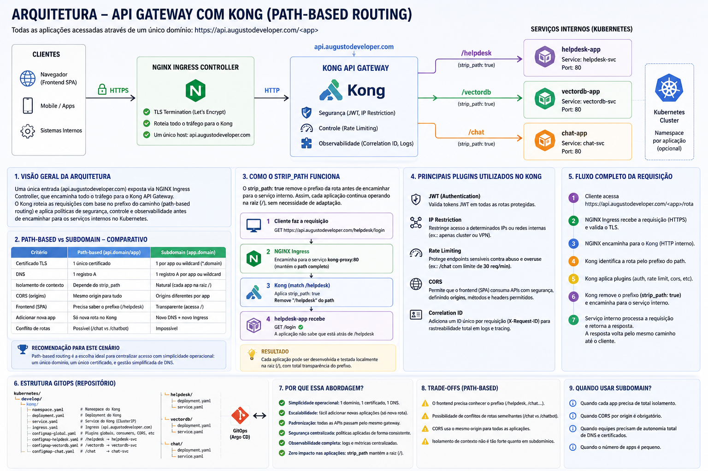

# Arquitetura de API Gateway com Kong + Kubernetes

## Visão Geral

Esta arquitetura utiliza o **Kong Gateway** como camada central de roteamento e segurança para múltiplas aplicações internas executando em Kubernetes.

A estratégia adotada foi **Path-Based Routing**, onde todas as aplicações compartilham o mesmo domínio principal:

```text
https://api.augustodeveloper.com/<app>
```

Exemplos:

* `/helpdesk`
* `/chat`
* `/vectordb`

Essa abordagem simplifica a operação da infraestrutura em ambientes enxutos (single VPS + Kubernetes + GitOps), reduzindo complexidade de DNS, certificados TLS e gerenciamento de ingressos.

---

# Objetivos da Arquitetura

A arquitetura foi desenhada para atender os seguintes objetivos:

* Centralizar autenticação e políticas de segurança
* Simplificar exposição de múltiplas aplicações
* Reduzir custo operacional
* Facilitar manutenção via GitOps
* Permitir escalabilidade futura sem alterar DNS/TLS
* Padronizar observabilidade e rastreamento

---

# Fluxo de Requisição

```text
┌─────────────┐
│   Cliente   │
└──────┬──────┘
       │
       ▼
┌───────────────────────────────┐
│ NGINX Ingress Controller      │
│ api.augustodeveloper.com      │
└──────────────┬────────────────┘
               │
               ▼
┌───────────────────────────────┐
│ Kong Gateway                  │
│                               │
│ /helpdesk  → helpdesk-svc     │
│ /chat      → chat-svc         │
│ /vectordb → vectordb-svc      │
└───────┬───────────┬───────────┘
        │           │
        ▼           ▼
┌────────────┐  ┌────────────┐
│ Helpdesk   │  │ Chat App   │
└────────────┘  └────────────┘
```

---

# Comparação das Estratégias

## Path-Based Routing vs Subdomain Routing

| Critério                 | Path-Based       | Subdomain-Based                    |
| ------------------------ | ---------------- | ---------------------------------- |
| URL                      | `api.domain/app` | `app.domain`                       |
| TLS                      | 1 certificado    | Wildcard ou múltiplos certificados |
| DNS                      | 1 registro       | 1 registro por app                 |
| Complexidade Operacional | Baixa            | Média/Alta                         |
| Adicionar nova aplicação | Apenas nova rota | DNS + Ingress + TLS                |
| CORS                     | Mesmo origin     | Origins separados                  |
| Isolamento               | Lógico           | Natural                            |
| Conflito de rotas        | Possível         | Inexistente                        |
| Facilidade para GitOps   | Excelente        | Boa                                |

---

# Por que Path-Based Routing?

Para este cenário específico, o modelo path-based oferece melhor relação entre simplicidade operacional e escalabilidade.

## Principais vantagens

### 1. Um único domínio público

Toda a plataforma é exposta através de:

```text
api.augustodeveloper.com
```

Isso reduz:

* configuração DNS
* gerenciamento de certificados
* renovação TLS
* complexidade de ingressos

---

### 2. Menos overhead operacional

Adicionar uma nova aplicação exige apenas:

1. Criar Deployment + Service
2. Adicionar rota no Kong
3. Aplicar via GitOps

Sem necessidade de:

* novo subdomínio
* novo certificado
* novo ingress
* propagação DNS

---

### 3. Melhor integração com GitOps

Toda a configuração de roteamento fica versionada em YAML.

Isso permite:

* rastreabilidade
* rollback simples
* auditoria
* padronização
* revisão via Pull Request

---

### 4. Centralização de segurança

O Kong aplica políticas globais e específicas por rota:

* JWT
* Rate limiting
* IP restriction
* Correlation ID
* CORS

Tudo em um único ponto.

---

# Papel do `strip_path`

O `strip_path` é essencial nessa arquitetura.

Sem ele, as aplicações precisariam conhecer o prefixo externo.

Exemplo sem `strip_path`:

```text
GET /helpdesk/login
```

A aplicação receberia exatamente:

```text
/helpdesk/login
```

Isso força o frontend/backend a serem desenvolvidos considerando o prefixo `/helpdesk`.

Com `strip_path: true`:

```text
Cliente:
GET /helpdesk/login
```

Kong transforma em:

```text
GET /login
```

A aplicação funciona normalmente na raiz `/`.

---

# Fluxo do `strip_path`

```text
Cliente
   │
   │ GET /helpdesk/login
   ▼
NGINX Ingress
   │
   ▼
Kong Gateway
   │
   │ match: /helpdesk
   │ strip_path: true
   ▼
Helpdesk Service
   │
   │ recebe: /login
   ▼
Aplicação
```

---

# Estrutura da Configuração Kong

## Serviço Helpdesk

```yaml
- name: helpdesk
  url: http://helpdesk-svc.default.svc.cluster.local:80
  routes:
    - name: helpdesk-route
      paths: [/helpdesk]
      strip_path: true
      plugins:
        - name: jwt
```

## O que acontece aqui?

| Configuração | Objetivo                        |
| ------------ | ------------------------------- |
| `paths`      | Define o prefixo público        |
| `strip_path` | Remove o prefixo antes do proxy |
| `jwt`        | Exige autenticação              |
| `url`        | Define o destino interno        |

---

# Plugins Aplicados

## JWT

Responsável por autenticação centralizada.

Benefícios:

* desacoplamento das aplicações
* padronização de autenticação
* menor duplicação de código

---

## Rate Limiting

Aplicado principalmente em rotas mais custosas.

Exemplo:

```yaml
- name: rate-limiting
  config:
    minute: 30
```

Objetivos:

* evitar abuso
* proteger recursos computacionais
* reduzir custo operacional

---

## IP Restriction

Utilizado para serviços internos.

Exemplo:

```yaml
allow: ["10.42.0.0/16"]
```

Benefícios:

* proteção de serviços sensíveis
* redução de superfície de ataque

---

## Correlation ID

Adiciona rastreabilidade distribuída.

```yaml
header_name: X-Request-ID
```

Permite:

* tracing entre serviços
* debugging distribuído
* auditoria

---

# Fluxo Completo da Plataforma

```text
┌──────────────────────────────┐
│ Internet                     │
└──────────────┬───────────────┘
               │
               ▼
┌──────────────────────────────┐
│ NGINX Ingress Controller     │
│ TLS Termination              │
└──────────────┬───────────────┘
               │
               ▼
┌──────────────────────────────┐
│ Kong API Gateway             │
│                              │
│ - JWT                        │
│ - CORS                       │
│ - Rate Limiting              │
│ - Correlation ID             │
│ - IP Restriction             │
└───────┬───────────┬──────────┘
        │           │
        ▼           ▼
┌────────────┐  ┌──────────────┐
│ Helpdesk   │  │ Vector DB    │
└────────────┘  └──────────────┘
```

---

# Estrutura GitOps

```text
kubernetes/
├── develop/
│   ├── kong/
│   │   ├── ingress.yaml
│   │   ├── deployment.yaml
│   │   ├── service.yaml
│   │   ├── configmap-global.yaml
│   │   ├── configmap-helpdesk.yaml
│   │   ├── configmap-vectordb.yaml
│   │   └── configmap-chat.yaml
│   │
│   ├── helpdesk/
│   ├── vectordb/
│   └── chat/
```

---

# Benefícios da Estrutura GitOps

## Modularidade

Cada aplicação possui:

* Deployment próprio
* Service próprio
* Configuração independente

---

## Escalabilidade

Novas aplicações podem ser adicionadas sem impacto estrutural.

Fluxo:

```text
Nova App
   ↓
Novo Service
   ↓
Nova Route Kong
   ↓
Deploy GitOps
   ↓
Disponível em /novaapp
```

---

## Versionamento completo

Toda alteração:

* fica auditável
* pode ser revertida
* passa por revisão
* possui histórico

---

# Trade-offs da Arquitetura

Apesar das vantagens, existem alguns pontos de atenção.

## Possível conflito de rotas

Exemplo:

```text
/chat
/chatbot
```

Necessário manter convenção clara de nomenclatura.

---

## Frontend deve suportar base path

SPAs precisam funcionar corretamente atrás de prefixos.

Exemplos:

* React Router basename
* Next.js basePath
* Vue Router history base

---

## Compartilhamento do mesmo origin

Todas aplicações compartilham:

```text
api.augustodeveloper.com
```

Isso simplifica autenticação, mas exige atenção em:

* cookies
* CORS
* headers globais

---

# Quando essa abordagem é ideal?

Essa arquitetura é excelente quando:

* existe uma única VPS ou cluster pequeno
* múltiplas aplicações internas coexistem
* deseja-se simplicidade operacional
* GitOps é utilizado
* há necessidade de padronização de segurança
* o time é reduzido

---

# Quando considerar subdomínios?

Subdomínios passam a fazer mais sentido quando:

* aplicações possuem times independentes
* isolamento forte é necessário
* políticas CORS distintas são críticas
* aplicações precisam de identidade própria
* existe multi-tenant complexo

---

# Conclusão

A estratégia de Path-Based Routing com Kong oferece uma arquitetura simples, consistente e altamente operacional para ambientes Kubernetes menores ou médios.

Os principais ganhos são:

* simplicidade operacional
* centralização de segurança
* baixo custo de manutenção
* facilidade de expansão
* excelente aderência ao modelo GitOps

O uso correto de `strip_path` torna as aplicações independentes da estrutura pública de URLs, permitindo que cada serviço continue funcionando normalmente na raiz `/`.

Isso reduz acoplamento e facilita desenvolvimento local, testes e manutenção.


